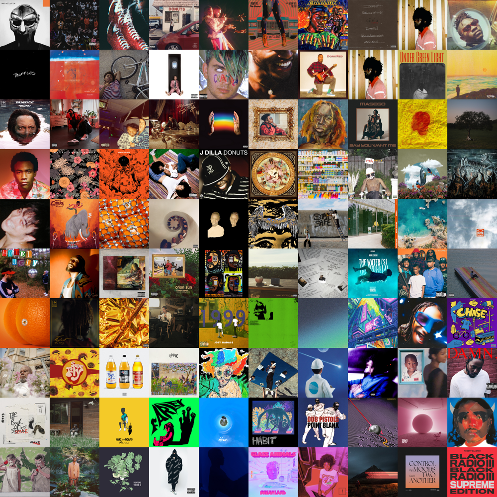
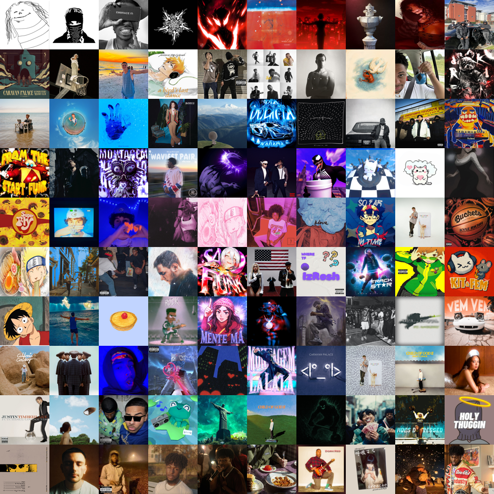
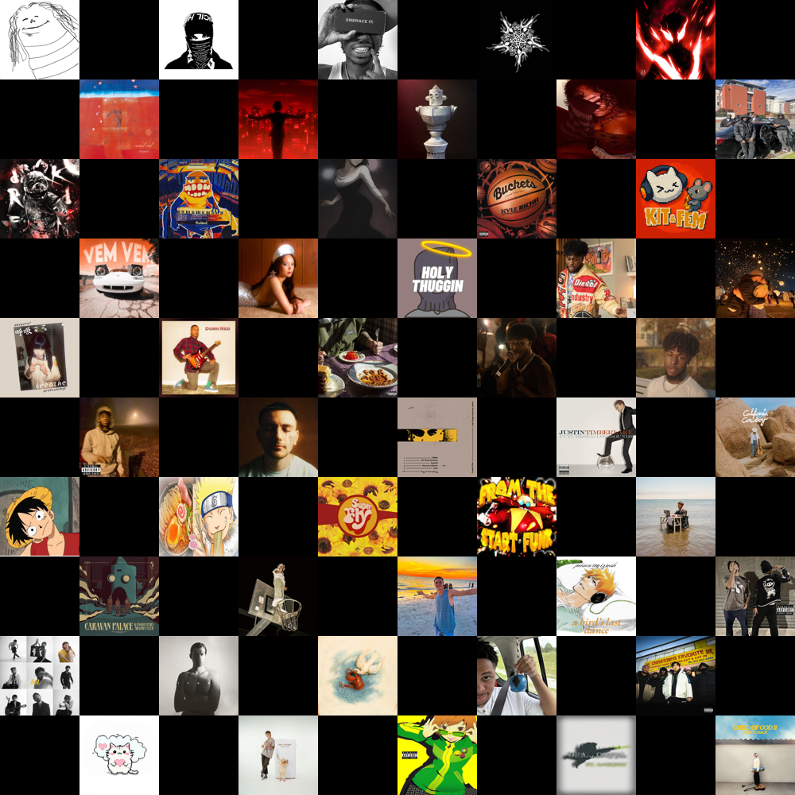

# Spotify Covers

Generate stunning album cover grid collages from your Spotify playlists or top tracks.


## Features

- **Playlist or Top Tracks** — generate grids from any playlist URL or your personal top tracks
- **Time range** — choose Last 4 Weeks, Last 6 Months, or All Time for top tracks
- **Custom grid size** — for top tracks, manually set the grid size (e.g. 10 for 10x10). Leave blank to auto-size. Errors gracefully if you don't have enough unique covers
- **4 grid patterns** — Normal, Diagonal, Spiral, Checkered
- **Resolution control** — Standard (100px), High (200px), Ultra (300px) per cell
- **Rounded corners** — apply rounded corners to the entire grid (transparent PNG)
- **Dark frame border** — export with a sleek dark rounded frame
- **Smart duplicate removal** — deduplicates by album ID, image URL, and pixel-level perceptual hashing
- **Real-time progress** — live progress bar showing download status as covers are fetched
- **Color sorting** — covers are automatically sorted by dominant hue for a rainbow effect

## Examples

| Normal | Diagonal | Spiral | Checkered |
|--------|----------|--------|-----------|
|  |  |  |  |

## Getting Started

### Prerequisites

- Python 3.11+
- A [Spotify Developer](https://developer.spotify.com/dashboard) app with `http://127.0.0.1:5000/callback` as a Redirect URI

### Setup

```bash
git clone https://github.com/SeanOnamade/spotifycovers.git
cd spotifycovers
python -m venv venv
source venv/Scripts/activate   # Windows (Git Bash)
pip install -r requirements.txt
```

Create a `.env` file:

```env
SPOTIFY_CLIENT_ID=your_client_id
SPOTIFY_CLIENT_SECRET=your_client_secret
```

### Run

```bash
flask run
```

Open http://127.0.0.1:5000, log in with Spotify, and generate your grid.

### Docker

```bash
docker build -t spotifycovers .
docker run -p 8000:8000 -e PORT=8000 \
  -e SPOTIFY_CLIENT_ID=... \
  -e SPOTIFY_CLIENT_SECRET=... \
  spotifycovers
```

## Tests

```bash
pip install pytest
pytest test_albumgrids.py -v
```

## Tech Stack

- **Backend** — Flask, Spotipy, Pillow, NumPy
- **Frontend** — Bootstrap 5, custom Spotify-themed dark UI with glassmorphism
- **Deployment** — Railway / Docker / Heroku
